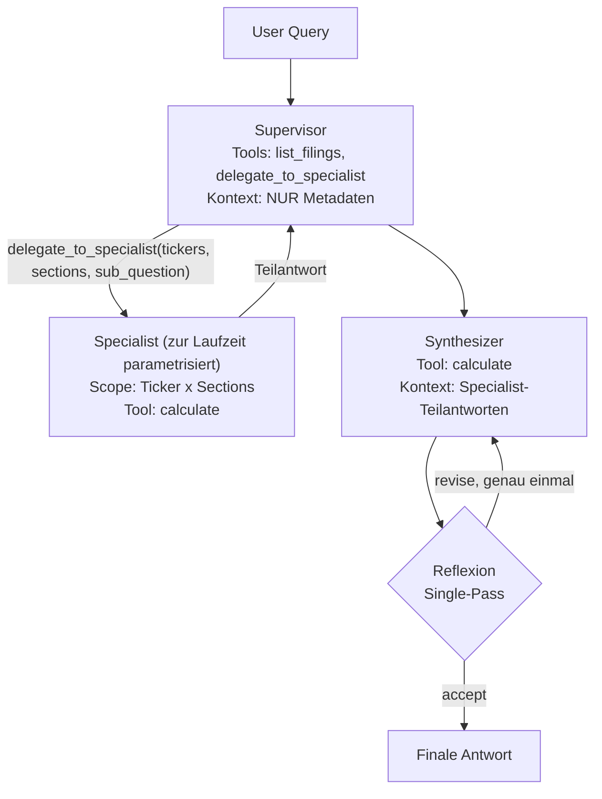

# System 4 — Multi-Agent Long Context: Architektur

**Status:** implementiert. Diese Datei beschreibt den *umgesetzten* Stand.

> Historie: Die ursprüngliche Fassung dieser Datei spezifizierte fest
> unternehmensgebundene Specialists (ein Agent je Ticker). Diese Variante wurde
> am 2026-07-25 zugunsten **parametrisierter Specialists** verworfen — siehe
> [SYS4_MULTI_AGENT_LOG.md](../../../docs/decisions/SYS4_MULTI_AGENT_LOG.md).
> Der alte Text ist über die Git-Historie dieser Datei erreichbar.

## Prinzip

S4 unterscheidet sich von S3 ausschließlich über die **Topologie**
(Kontext-Routing), nicht über das Wissens-Tool-Set. Die Wissens-Werkzeuge
(`calculate`, `list_filings`) sind mit S2/S3 identisch und liegen in
[`src/common/tools/`](../../common/tools/). Der einzige S4-exklusive Tool-Call
ist `delegate_to_specialist` — ein Orchestrierungs-Primitiv, das kein Wissen
liefert, sondern nur die Graph-Topologie ansteuert, und deshalb vom
Tool-Symmetrie-Prinzip ausgenommen ist.

## Topologie

Der Supervisor wählt den Scope zur Laufzeit; es gibt keinen festen Specialist
je Unternehmen. Damit werden auch Single-Company-Fragen (FA-1 bis FA-3)
tatsächlich dekomponiert, statt die Architektur faktisch auf S3 mit
reduziertem Kontext zu reduzieren.

## Module

| Bestandteil | Datei |
|---|---|
| Zustandsdefinition, Reducer | [`graph.py`](graph.py) |
| Knotenfunktionen, Specialist-Runner, `query()` | [`pipeline.py`](pipeline.py) |
| Supervisor-/Specialist-/Synthesizer-Prompts | [`prompts.py`](prompts.py) |
| `delegate_to_specialist` | [`tools.py`](tools.py) |
| ReAct-Factory, Message-Parser, Reflexion, Wissens-Tools | [`src/common/`](../../common/) |
| Parameter (Limits je Rolle) | [`configs/multi_agent.yaml`](../../../configs/multi_agent.yaml) |

## Reflexion

S4 teilt Kette, Verdict-Schema, Feedback-Erzeugung und die Single-Pass-Policy
mit S2/S3 ([`src/common/reflection.py`](../../common/reflection.py)), nutzt aber
nicht `run_reflection_pass`: Die Korrekturrunde ist eine bedingte Graph-Kante
zurück zum Synthesizer, der einen frischen Agenten mit genau einer Nachricht
aufruft — es wird keine Tool-Call-Historie erneut gesendet. Der
Thought-Signature-Guard aus `run_reflection_pass` ist hier deshalb
gegenstandslos.

## Zusatzmetriken je Query

`num_specialists_invoked`, `token_breakdown` (Rolle -> TokenUsage, inkl.
`supervisor`, `specialist_<scope>`, `synthesizer`, `reflection`) sowie
`delegation_requests` — Grundlage der H3-Effizienzauswertung.
