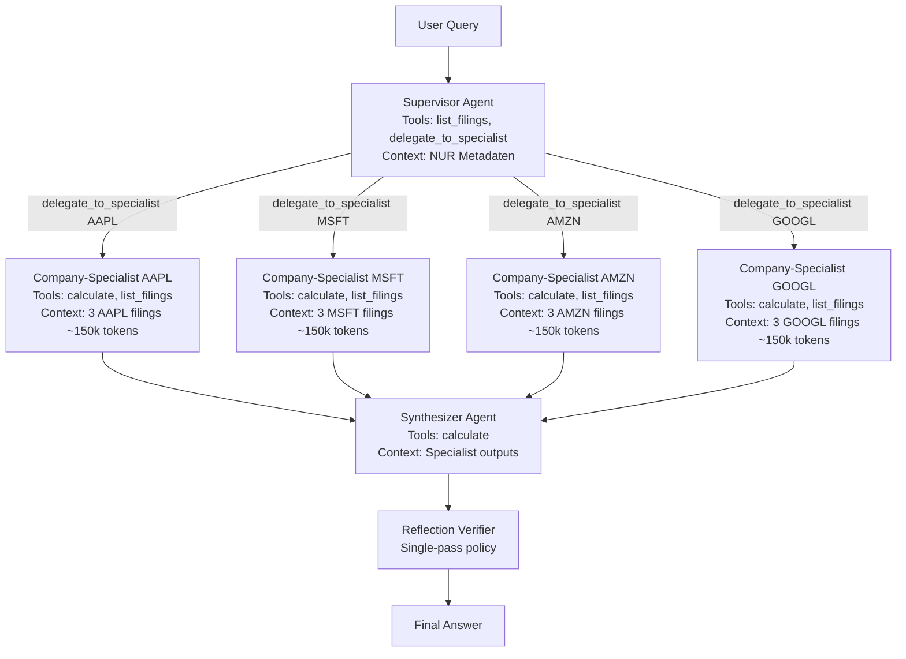

# System 4 — Multi-Agent Long Context: Architektur-Spezifikation

**Status:** Spec (nicht implementiert). Diese Datei beschreibt die geplante
S4-Topologie auf Basis der Entscheidung in
[../../../docs/decisions/SYS4_MULTI_AGENT_LOG.md](../../../docs/decisions/SYS4_MULTI_AGENT_LOG.md)
vom 2026-05-17. Implementierung folgt in einem eigenen Workpaket.

## Architektur-Prinzip

System 4 unterscheidet sich von System 3 ausschliesslich ueber die
**Topologie** (Kontext-Routing), nicht ueber das Wissens-Tool-Set. Die
Wissens-Tools (`calculate`, `list_filings`) bleiben symmetrisch zu S2/S3.
Der einzige S4-exklusive Tool-Call ist das Orchestrierungs-Primitiv
`delegate_to_specialist`, das kein Wissen liefert, sondern nur
Sub-Agenten startet.

## Topologie



Nicht jede Specialist-Instanz wird pro Query gestartet. Beispiele:

| Query-Typ | Aktive Specialists | Erwartete Token-Last |
|---|---|---|
| FA-1 (Single-Fact, ein Ticker) | 1 | ~150k pro Iteration |
| FA-2 (Cross-Section, ein Ticker) | 1 | ~150k pro Iteration |
| FA-3 (Multi-Year, ein Ticker) | 1 | ~150k pro Iteration |
| FA-4 pairwise (zwei Ticker) | 2 | ~300k pro Iteration |
| FA-4 max/min (alle 4 Ticker) | 4 | ~600k pro Iteration (=S3-Niveau) |
| FA-Refusal | 0-1 (Supervisor verweigert direkt) | ~5k pro Iteration |

Damit wird der Effizienzvorteil gegenueber S3 auf FA-1 / FA-2 / FA-3 / FA-4-pairwise konzentriert; FA-4-max/min ist erwartungsgemaess die Parity-Untergrenze.

## State Definition (LangGraph)

```python
from typing import Annotated, TypedDict
from langgraph.graph.message import add_messages


class SupervisorState(TypedDict):
    messages: Annotated[list, add_messages]
    user_query: str
    relevant_tickers: list[str]
    specialist_outputs: dict[str, str]  # ticker -> partial answer
    final_answer: str | None
    reflection_verdict: dict | None
```

## Tool-Definitionen

`delegate_to_specialist` ist das einzige S4-exklusive Tool. Es ist als
*Orchestrierungs-Primitiv* einzustufen — der Supervisor benutzt es, um
einen LangGraph-Sub-Graph zu starten und auf dessen Ergebnis zu warten.

```python
@tool
def delegate_to_specialist(
    ticker: Literal["AAPL", "MSFT", "AMZN", "GOOGL"],
    sub_question: str,
) -> str:
    """Start a Company-Specialist sub-agent for the given ticker.

    The specialist sees ONLY the 3 filings of that ticker (FY2022, FY2023,
    FY2024) in its system prompt and answers the sub_question against them.
    Use one call per ticker that is relevant to the user query. For
    cross-company questions, call this tool multiple times and then
    synthesize.
    """
```

Specialist- und Synthesizer-Tool-Listen referenzieren die bestehenden
Tool-Module aus S2:

- `src/systems/rag_agent/tools/calculate.py` (Specialists + Synthesizer)
- `src/systems/rag_agent/tools/list_filings.py` (Specialists)

(Falls die in [BACKLOG.md](../../../docs/decisions/BACKLOG.md) P3
"Shared tool module nach `src/common/tools/`" inzwischen umgesetzt wurde,
wird auf die `src/common/tools/`-Variante referenziert.)

## Reflection-Layer

Identisch zu S2/S3: `build_reflection_chain` aus
[../rag_agent/reflection.py](../rag_agent/reflection.py) wird auf die
Synthesizer-Ausgabe angewendet. Single-pass-Korrektur-Policy bleibt erhalten.
Bei `status="revise"` wird die Frage an den Synthesizer mit dem
Feedback-Message zurueckgegeben — nicht an den Supervisor (keine erneute
Specialist-Aktivierung), um Token-Kosten kontrolliert zu halten.

## Konfigurations-Skelett

```yaml
# configs/multi_agent.yaml (geplant)
supervisor:
  max_iterations: 4  # Anzahl delegate_to_specialist-Calls pro Query
  recursion_limit: 10

specialist:
  max_iterations: 5
  recursion_limit: 12
  per_ticker_filings: 3  # FY2022, FY2023, FY2024

synthesizer:
  max_iterations: 3
  recursion_limit: 8

reflection:
  enabled: true  # Symmetrie zu S2/S3
```

## Messplan (gehoert zur Evaluation, nicht zur Implementierung)

Pro Query werden zusaetzlich zu den Standard-`RunMetrics` erhoben:

- `num_specialists_invoked`: Anzahl gestarteter Specialist-Sub-Agenten
- `specialist_token_breakdown`: dict ticker -> tokens
- `supervisor_overhead_tokens`: nur Supervisor-LLM-Tokens
- `synthesizer_tokens`: nur Synthesizer-LLM-Tokens

Diese erlauben die in [SYS4_MULTI_AGENT_LOG.md](../../../docs/decisions/SYS4_MULTI_AGENT_LOG.md)
2026-05-17 definierten H3-Operationalisierungen (Token-Effizienz,
Cost-per-Correct, Quality-Parity) zu pruefen.

## Out of Scope dieser Spec

- Konkrete LangGraph-Implementierung (`StateGraph`, Nodes, Edges) — kommt im Implementierungs-Workpaket.
- Pipeline-Klasse `MultiAgentPipeline` analog zu `AgentRAGPipeline` / `LongContextPipeline`.
- Test-Suite und Smoke-Tests.
- `configs/multi_agent.yaml` als fertige Datei.
